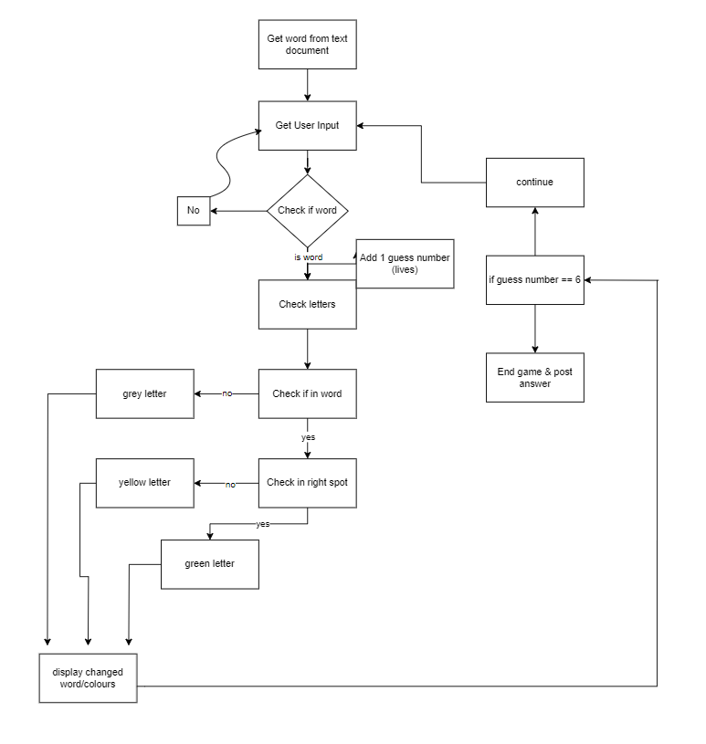

## Requirement

    pip install termcolor

## pseudo-code

this is pseudo-code. it doesnt work.

    import random as r

    tw = open("target_words.txt", "r")
    aw = open("all_words.txt", "r")
    guess_count = 0

    maxlen = r.randint(0, len(tw))
    i = 0
    while i <= maxlen:
        f.readline()
        i+=1
    tar_word = f.readline()

    while True:
        while True:
            word = input("word >> ")
            if word in aw:
                break
            else:
                print("not a word")
                continue
        guess_count += 1

        for char in word:
            if char in tar_word and char in correct_position:
                return green
            elif char in tar_word:
                return yellow
            else:
                return grey
        print(changed_word)
        if guess == 6:
            print(tar_word)
            quit()
        else:
            continue

---
## Flowchart

---
